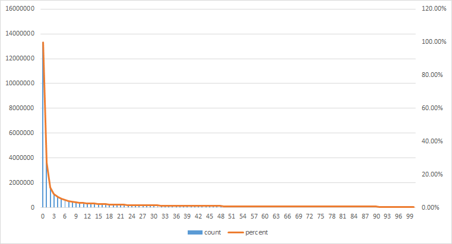
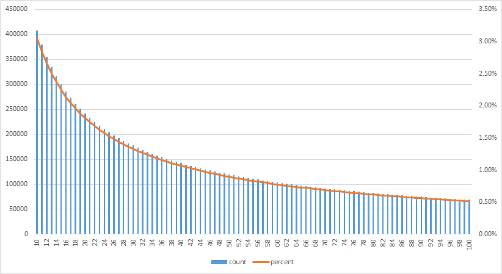

# github-repo-stars-rank-list
A simple script to get all github repo's stars, to generate a rank list  
利用github搜索的筛选器来得到每个stars有多少repo, 进而产生一个github项目的星星排行榜  

好吧其实只是干正事累了随便写的QAQ  

## usage
`python3 rank.py [Start] [End]`  
eg: `python3 rank.py 0 100`  

The result will be written to `output.csv`  

> **Notice**  
> Script will run in 2 processes, 4 thread per process  
> Request failure will be handled automatically.  
> Because the API was slow, so you can do other things during this.  

## How It Works
By using github's search filter,  
for example, please click the following link:  
[Repos That Has More Than 100 Stars](https://github.com/search?utf8=%E2%9C%93&q=stars%3A%3E%3D100&type=Repositories&ref=searchresults)  

And [the github search API](https://developer.github.com/v3/search/#search-repositories)  

## result
### pic
0-100:  
  

10-100:
  

### table
| stars | count    | percent |
|:------|:---------|:--------|
| 0     | 13357738 | 100.00% |
| 1     | 3628902  | 27.17%  |
| 2     | 1622670  | 12.15%  |
| 3     | 1099775  | 8.23%   |
| 4     | 851263   | 6.37%   |
| 5     | 704986   | 5.28%   |
| 6     | 608134   | 4.55%   |
| 7     | 537853   | 4.03%   |
| 8     | 484596   | 3.63%   |
| 9     | 442312   | 3.31%   |
| 10    | 407566   | 3.05%   |
| 11    | 379139   | 2.84%   |
| 12    | 355003   | 2.66%   |
| 13    | 334265   | 2.50%   |
| 14    | 316066   | 2.37%   |
| 15    | 299957   | 2.25%   |
| 16    | 285859   | 2.14%   |
| 17    | 273238   | 2.05%   |
| 18    | 261650   | 1.96%   |
| 19    | 250913   | 1.88%   |
| 20    | 241364   | 1.81%   |
| 21    | 232630   | 1.74%   |
| 22    | 224605   | 1.68%   |
| 23    | 217206   | 1.63%   |
| 24    | 210464   | 1.58%   |
| 25    | 204057   | 1.53%   |
| 26    | 198143   | 1.48%   |
| 27    | 192439   | 1.44%   |
| 28    | 187121   | 1.40%   |
| 29    | 182288   | 1.36%   |
| 30    | 177584   | 1.33%   |
| 31    | 173178   | 1.30%   |
| 32    | 168944   | 1.26%   |
| 33    | 165023   | 1.24%   |
| 34    | 161329   | 1.21%   |
| 35    | 157758   | 1.18%   |
| 36    | 154388   | 1.16%   |
| 37    | 151203   | 1.13%   |
| 38    | 148092   | 1.11%   |
| 39    | 145150   | 1.09%   |
| 40    | 142291   | 1.07%   |
| 41    | 139603   | 1.05%   |
| 42    | 136980   | 1.03%   |
| 43    | 134459   | 1.01%   |
| 44    | 132029   | 0.99%   |
| 45    | 129821   | 0.97%   |
| 46    | 127617   | 0.96%   |
| 47    | 125539   | 0.94%   |
| 48    | 123453   | 0.92%   |
| 49    | 121470   | 0.91%   |
| 50    | 119569   | 0.90%   |
| 51    | 117776   | 0.88%   |
| 52    | 116007   | 0.87%   |
| 53    | 114275   | 0.86%   |
| 54    | 112587   | 0.84%   |
| 55    | 110928   | 0.83%   |
| 56    | 109389   | 0.82%   |
| 57    | 107889   | 0.81%   |
| 58    | 106474   | 0.80%   |
| 59    | 105045   | 0.79%   |
| 60    | 103680   | 0.78%   |
| 61    | 102366   | 0.77%   |
| 62    | 101117   | 0.76%   |
| 63    | 99874    | 0.75%   |
| 64    | 98662    | 0.74%   |
| 65    | 97445    | 0.73%   |
| 66    | 96312    | 0.72%   |
| 67    | 95118    | 0.71%   |
| 68    | 93973    | 0.70%   |
| 69    | 92932    | 0.70%   |
| 70    | 91890    | 0.69%   |
| 71    | 90835    | 0.68%   |
| 72    | 89877    | 0.67%   |
| 73    | 88909    | 0.67%   |
| 74    | 87911    | 0.66%   |
| 75    | 87013    | 0.65%   |
| 76    | 86091    | 0.64%   |
| 77    | 85221    | 0.64%   |
| 78    | 84399    | 0.63%   |
| 79    | 83537    | 0.63%   |
| 80    | 82651    | 0.62%   |
| 81    | 81828    | 0.61%   |
| 82    | 81074    | 0.61%   |
| 83    | 80273    | 0.60%   |
| 84    | 79533    | 0.60%   |
| 85    | 78747    | 0.59%   |
| 86    | 77971    | 0.58%   |
| 87    | 77238    | 0.58%   |
| 88    | 76507    | 0.57%   |
| 89    | 75792    | 0.57%   |
| 90    | 75088    | 0.56%   |
| 91    | 74402    | 0.56%   |
| 92    | 73768    | 0.55%   |
| 93    | 73086    | 0.55%   |
| 94    | 72485    | 0.54%   |
| 95    | 71883    | 0.54%   |
| 96    | 71274    | 0.53%   |
| 97    | 70671    | 0.53%   |
| 98    | 70122    | 0.52%   |
| 99    | 69599    | 0.52%   |
| 100   | 69092    | 0.52%   |
|       |          |         |

## About Accuracy
The result of `stars:>=0` is not quite accurate,  
you can try the following link by your self:  
https://github.com/search?utf8=%E2%9C%93&q=stars%3A%3E%3D0&type=Repositories&ref=searchresults  
The results number are not stable  
However, I tried several times, and picked the largest value.  

Though the result `stars:>=0` is not good, others are quite accurate.  
If you try several times, it won't change too much.  

So, I think this rank-list is believable.  

